<div align="center">

# Circle to Search

**Shake the mouse. Circle anything on your screen. Get a Google Lens result.**

Google's phone gesture, for KDE Plasma 6 on Wayland.

[](https://github.com/fand1l/cts_gl/actions/workflows/ci.yml)
&nbsp;·&nbsp;
[**🇺🇦 Українською**](README.uk.md)
&nbsp;·&nbsp;
[Technical documentation](docs/TECHNICAL.md)

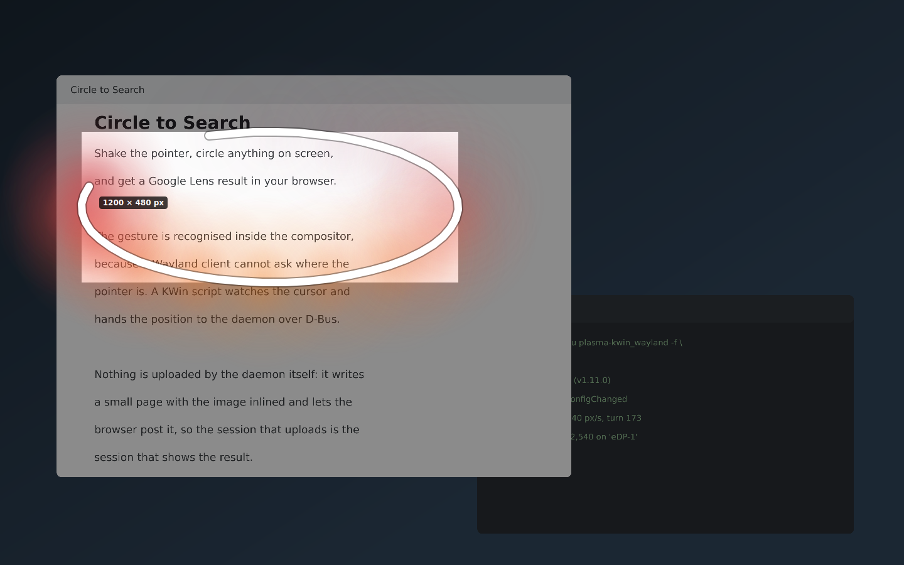

</div>

---

## What it does

Shake the pointer diagonally — down-right, up-left, down-right — and the screen
freezes and dims. Draw a loop around whatever you were curious about. It opens in
Google Lens in your browser.

That is the whole idea. Everything below is what happens around it.

* **Circle it, or drag a box.** Freehand by default, like on a phone. Hold
  *Shift* for a rectangle, or click a window to take exactly that window.
* **Nothing is sent until you say so.** The selection waits with handles you can
  drag and buttons that say what each one does. An upload cannot be taken back,
  so there is a moment to check first.
* **Black out anything that must not leave** — a token, an address, a name in
  the corner. It is filled solid *before* the image is made, so no version of it
  with them still in ever exists.
* **Copy or save instead of searching.** The same selection, three other places
  to send it.
* **Or pin it to the screen** and keep it there while you work — for when what
  you need to read is behind the window you have to type into.
* **The same area as last time**, to the pixel — for watching a number that
  changes, where a rectangle redrawn by hand is never quite the same one.
* **Pick a colour off the screen.** The screen is already frozen and already
  magnified under your pointer; click a pixel and its hex is in the clipboard.
* **Select the text on your frozen screen**, then search for the words
  themselves rather than a picture of them — or copy them, without any of it
  leaving the machine. An optional local text recognition, off until you turn it
  on.
* **Ukrainian and English**, following your system language.

---

## Screenshots

| | |
|---|---|
| 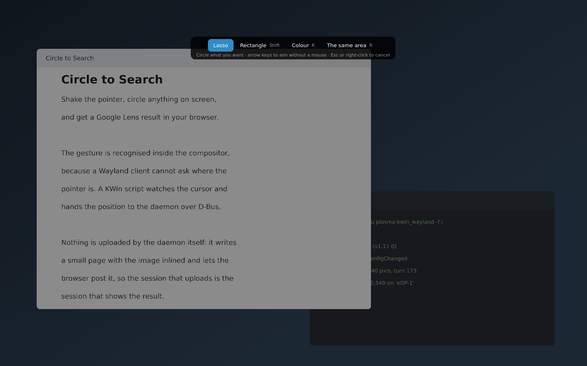 **Shake, and the screen freezes.** Lasso or rectangle — or the same area as last time. |  **Circle it.** A wide white line with a coloured glow that follows your hand. |
| 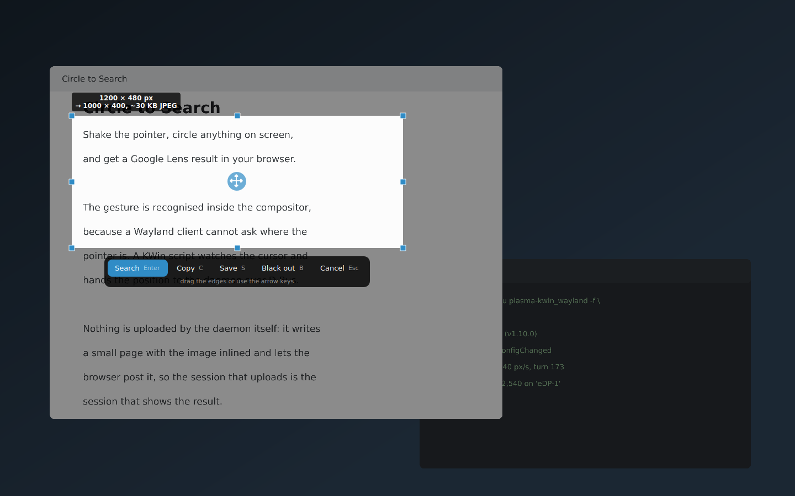 **Nothing has been sent yet.** It says what it is about to send, in pixels and kilobytes. | 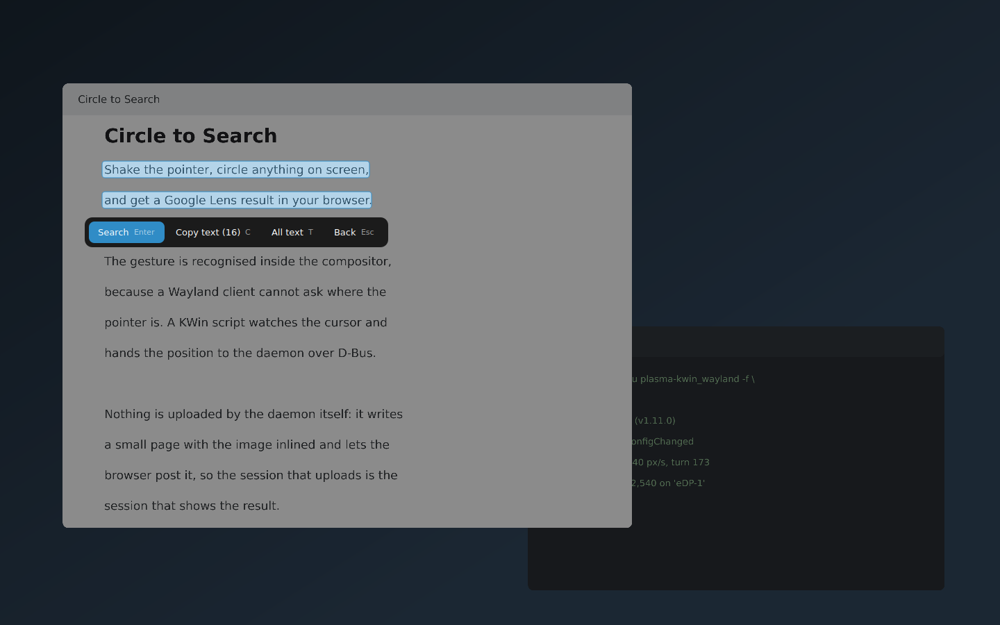 **Drag across text and you get the text** — searched for as words, not as a picture. |
| 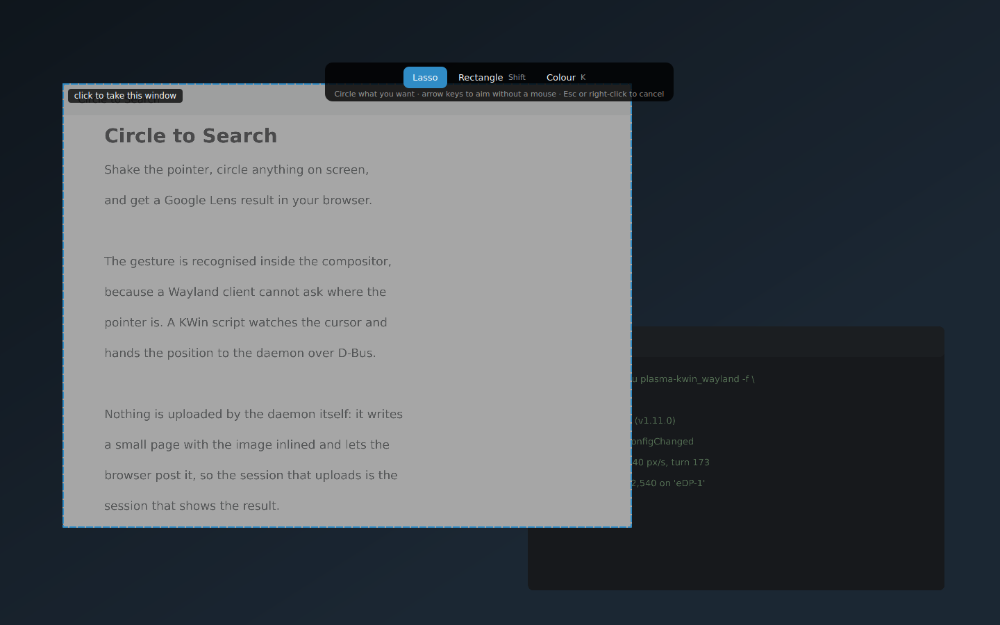 **Click a window** instead of drawing carefully around it. | 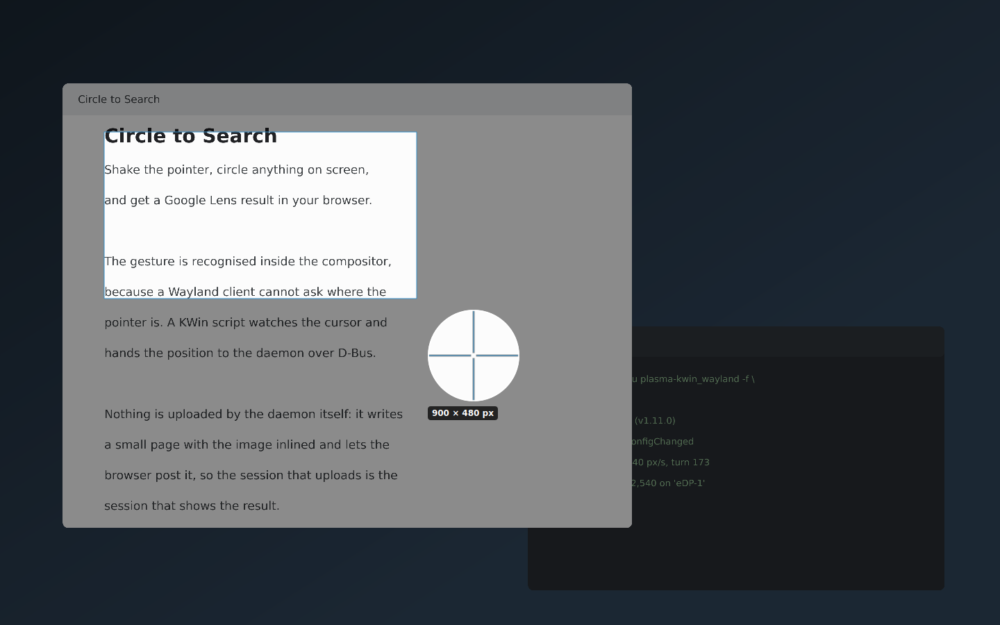 **A magnifier while you aim**, so the edge lands where you meant. |

---

## Installing it

You need **KDE Plasma 6 on Wayland** and **Python 3.11 or newer**.

```bash
git clone https://github.com/fand1l/cts_gl.git
cd cts_gl
./install.sh
```

That is all. The installer works out what your distribution is — Fedora, Debian,
Ubuntu, Arch, openSUSE — and asks before installing anything. It never needs
root for the application itself; only your package manager will ask.

It installs four things into your home directory: the daemon, the KWin script
that watches the cursor, a `systemd --user` service so it starts with your
session, and a desktop entry.

**Log out and back in** after installing, so KWin loads the script.

Later, one command keeps it current — it follows the `deploy` branch:

```bash
./install.sh update
```

It tells you what you have and what it is about to install — every release has a
name as well as a number, so `1.2.0 “better-version-control”` says which one it
is. [What changed in each](CHANGELOG.md).

It will not quietly install something older than what you already have. Going
back is allowed — it is the way out of a `--dev` build that broke — but it takes
`--downgrade`, and it erases the settings with it, because the newer version
wrote settings the older one cannot read. Your captures are kept, and it asks
again first.

<details>
<summary>Other commands</summary>

```bash
./install.sh update               # fetch the deploy branch and reinstall
./install.sh update --dev         # …fetch "dev" instead: the newest work, unreviewed
./install.sh update --downgrade   # …even if it is older, settings and all
./install.sh reinstall            # reinstall this folder, whatever state it is in
./install.sh reinstall --config   # …and wipe the settings too (it asks twice)
./uninstall.sh                    # remove it, keep your captures
./uninstall.sh --purge            # remove it and the captures
```

Any of them takes `--debug`, which prints everything each step did instead of a
tick.

`update` is the one to remember. It follows the **`deploy`** branch — the code
that has been decided to be fit to run — and moves the checkout there if it is
standing somewhere else. `reinstall` has nothing to do with git: it installs
whatever is in the folder you are in.

`--dev` follows **`dev`** instead, which is where work is pushed as it happens.
Nothing on it has been looked at yet and it is expected to be broken sometimes,
so it says so every time you use it. Plain `update` goes back to `deploy`.

The order cannot leave you worse off: if the fetch fails, nothing has been moved
or removed and the copy you had is still the one running. Your settings, your
captures and your calibration are kept either way.

</details>

---

## Using it

### The gesture

Shake the pointer **diagonally** — down-right, up-left, down-right — briskly, in
one place. Roughly 150 pixels a swing, twice, inside about half a second.

If it does not fire, or fires while you are just working, do not go hunting
through settings: **Settings → Calibrate the gesture…** measures a dozen of your
own shakes and writes all the thresholds from them. Above the button, a dot
travels the exact movement your current settings are asking for, so you can see
what they mean.

You can also press **Meta+Shift+L**, or use **Capture now** in the tray menu.

### Once the screen is frozen

| | |
|---|---|
| **Drag** | draw a loop, or hold *Shift* for a rectangle |
| **Arrow keys** | aim without a mouse; *Space* for one corner, then the other |
| **Click a window** | take exactly that window |
| **Drag across text** | take the text instead of a picture |
| **The same area**, or *R* | exactly where you selected last time |
| **Colour**, or *K* | pick a colour off the screen instead |
| **Esc** or right-click | forget it |

Then the selection waits. Drag the eight handles to resize, the grip in the
middle to move it, the arrow keys to nudge it a pixel at a time — and press
anywhere else to start again.

**Without a mouse at all:** the arrow keys raise a crosshair and move it —
*Ctrl* to travel, *Shift* for one pixel at a time. *Space* pins one corner,
the arrows size the box from it, and *Space* again takes it. From there it is
the same waiting selection, with the same keys on it. *Esc* lets go of the
corner without letting go of the capture.

Above it, two lines: the size of what you have selected, and under it what will
actually leave — `→ 1000 × 400, ~30 KB JPEG`. They are not the same number, and
now you can see what *Longest side* and *JPEG quality* are doing.

| button | key | |
|---|---|---|
| **Search** | *Enter* | send it to Google Lens |
| **Copy** | *C* | to the clipboard |
| **Save** | *S* | a PNG in Pictures |
| **Pin** | *P* | leave it on screen, above everything |
| **Black out** | *B* | paint over anything that must not leave |
| **Cancel** | *Esc* | forget it |

**Pin** is the other one worth knowing about. It leaves that crop on your screen
as a small window above everything else, which you can drag around, scroll to
zoom, and close with *Esc* or a middle click. *Ctrl+C* on it copies it. Useful
whenever the thing you have to read is behind the window you have to type into.

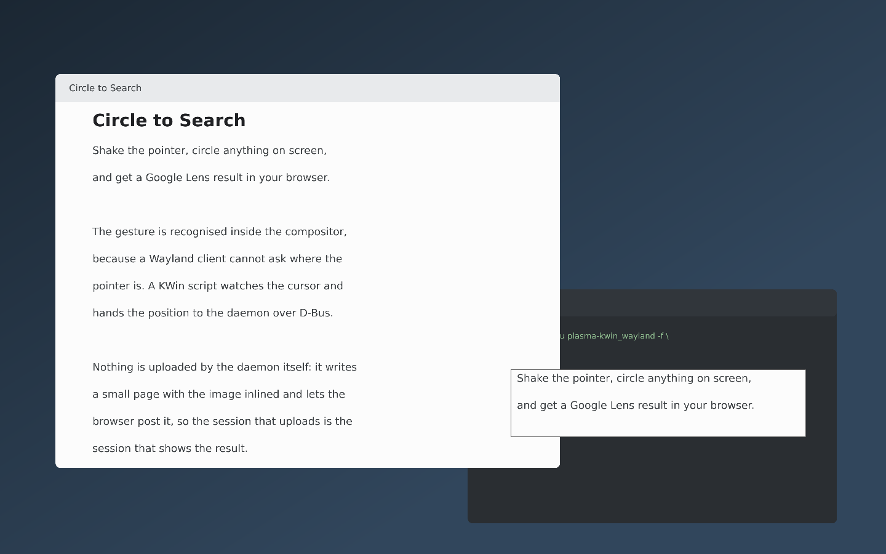

**Black out** is worth knowing about too. Turn it on and drag over the token, the
address, the name in the corner — they are filled solid *before* the image is
made, so there is no version of it with them still in. *Backspace* undoes the
last one, *Esc* leaves the mode. The words under them are dropped from the
recognised text too.

### Picking a colour

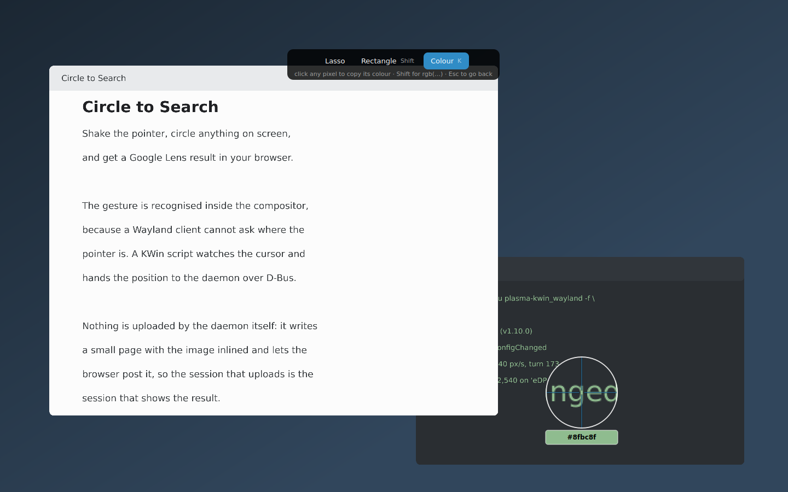

**Colour** (*K*) turns the overlay into a screen colour picker. The dimming
lifts, the magnifier follows your pointer with the pixel's colour and hex under
it, and a click copies `#rrggbb` — or `rgb(…)` with *Shift* held. *Esc* goes
back to selecting.

Plasma has an eyedropper of its own, so this is not new for the desktop. It is
here because the answer was already on screen: by the time you wonder what
colour that is, this program has frozen the screen and magnified it under your
pointer, and was throwing the value away.

### Reading the text on screen

Turn on **Make the text on screen selectable** and the words on the frozen screen
become selectable, like text in a browser. Drag across a sentence, or press *T*
to take everything found.

| button | key | |
|---|---|---|
| **Search** | *Enter* | search for the words, not a picture of them |
| **Copy text** | *C* | to the clipboard |
| **All text** | *T* | take everything on screen |
| **Back** | *Esc* | let go of the text, keep the capture |

Searching here uploads nothing at all — the words are already read, so it is a
plain web search. And if what you picked out is a link, the button says **Open
the link** and opens it instead.

The reading runs `tesseract` on your own machine. Nothing is uploaded, no key is
needed, and it is off until you ask for it.

### The tray

The icon dims when shaking will not work, and its tooltip says which of the
several possible reasons it is — including the one that is genuinely hard to
guess, where KWin is still running an older copy of the script than the one on
disk.

**Recent captures** has the newest few, and **All of them…** opens a window with
the rest.

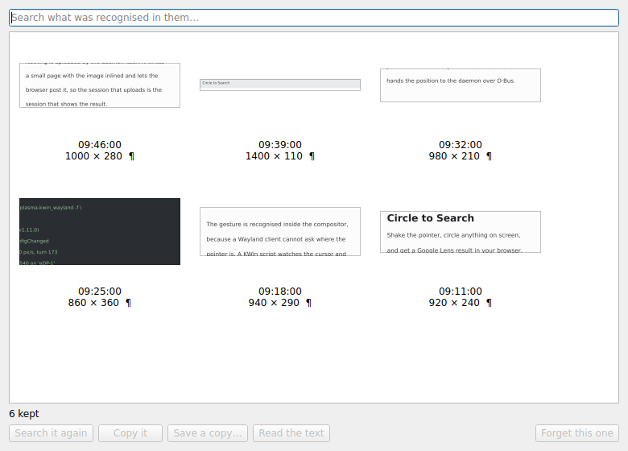

The box at the top searches **the text that was recognised inside them**, so
"what was that error I looked up last week" is answerable. Every capture can be
searched again, copied, saved or read from here, and *Delete* forgets one.

How many are kept is up to you now — it used to be five, because a tray menu of
thirty is unusable, which was a statement about the menu.

---

## Settings

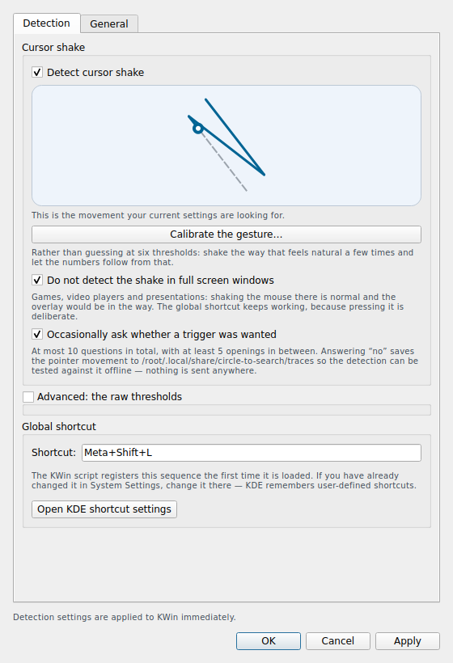

Most of it you will never need. The ones worth knowing:

| | |
|---|---|
| **Calibrate the gesture…** | measures your shake and sets every threshold from it |
| **Detect cursor shake** | off leaves the shortcut and the tray working |
| **Selection shape** | lasso or rectangle; *Shift* swaps it for one drag |
| **Check the selection before sending it** | on — off goes back to sending the moment you let go |
| **Magnify while dragging** | the loupe beside the pointer |
| **Make the text on screen selectable** | the optional local text recognition |
| **How many to keep** | the captures the tray and the captures window offer |
| **Open an overlay on every monitor** | so a selection can cross the seam |

The ten raw thresholds are folded away behind **Advanced**, because calibrating
is nearly always the better way round.

---

## If something does not work

Ask it:

```bash
circle-to-search --doctor
```

It checks every moving part — the session, the daemon, its service, the KWin
script and whether KWin is running the copy that is installed, the shortcut,
the screen capture (by really taking one), the browser, and the text
recognition — and prints the fix next to whatever is wrong.

```
  ✓  daemon            io.github.fand1l.CircleToSearch is on the bus
  ✗  KWin script       KWin is running v1.10.0, but v1.11.0 is installed
                       KWin loads a script once, at login, and keeps running that copy.
                       Toggle it off and on in System Settings → Window Management →
                       KWin Scripts, or log out and back in.
  ✓  screen capture    kwin-screenshot2, 3840×2160 px in 84 ms
```

**Nothing happens when I shake.** Hover the tray icon — it will tell you which
part is wrong. Most often the answer is *log out and back in*: KWin loads a
script once, at login, and keeps running that copy.

**It opens while I am just working.** Calibrate. Failing that, raise *Minimum
swing speed* under **Advanced** — deliberate shaking is a flick, and drawing and
dragging are slow.

**The overlay is behind my panel.** The KWin script is what lifts it; if that is
not loaded, it cannot. Check *System Settings → Window Management → KWin
Scripts*.

**The Lens page opens empty.** The upload is done by your browser, not by this
program, so a browser that blocks the request is the usual cause. Try it in a
window without content blocking.

**The upload failed.** The notification now has a **Try another way** button.
There are two ways this can send a picture — your browser posts it, or this
program does — and they fail for unrelated reasons, so the button swaps them
rather than trying the same one again. Your selection is still in memory; it
is offered once, and then it reports plainly.

Longer answers, and about twenty other failure modes with the reasoning behind
each, are in the [technical documentation](docs/TECHNICAL.md#what-can-break-and-how-to-debug-it).

---

## Privacy, plainly

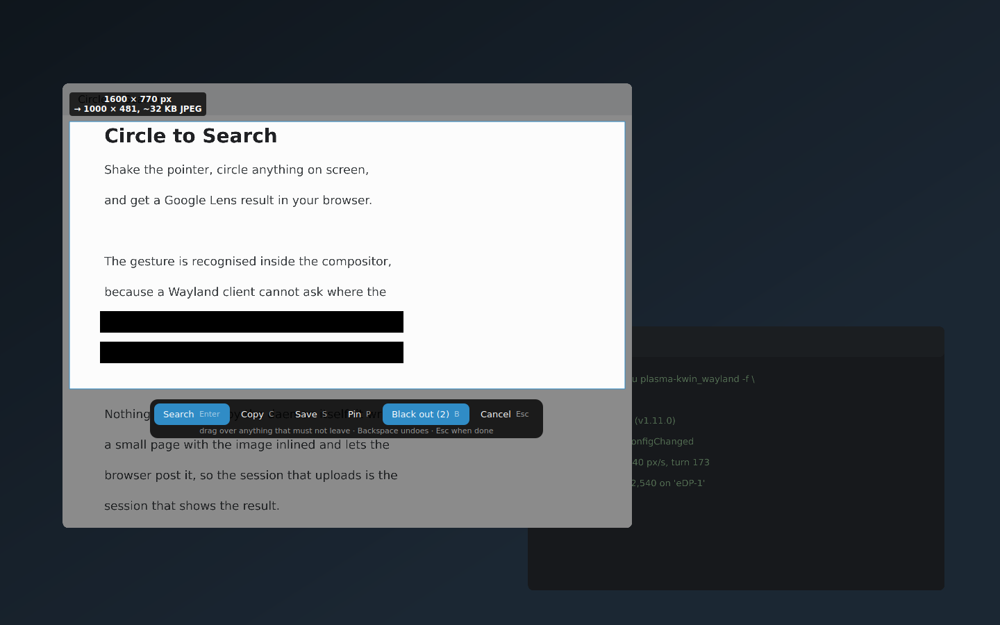

* **You can paint over part of it first.** *Black out* fills the rectangles you
  drag solid, and it happens before the image is made — not on top of it. There
  is no copy of the picture with them still in, in the clipboard, in the saved
  PNG, in the kept capture or in the page the browser posts. The words under
  them are dropped from the recognised text too.
* The daemon **makes no network connections of its own**. It writes a small
  local page with your selection inlined and hands it to your browser, and the
  browser is what talks to Google. So the session that uploads is your session,
  which is also why the result page opens where you can read it.
* **Text recognition is local.** `tesseract`, on your machine, and only if you
  turn it on.
* **No API keys, no accounts, no telemetry.** Nothing is collected.
* The last five captures are kept in `~/.local/share/circle-to-search/recent`
  so the tray can offer them again. Turn it off, or use `./uninstall.sh --purge`.

---

## Who wrote this

**This program was written by Claude**, Anthropic's AI model, over a series of
sessions — the architecture, the code, the tests, and this documentation.

[@fand1l](https://github.com/fand1l) directed the work: chose what to build,
tested every version on real hardware, and sent back the screenshots and bug
reports that corrected it. Several of the things that make it worth using —
selectable text on the frozen screen, the Android-style stroke, catching the
window that could not be seen — exist because they tried it and said what was
wrong.

It seemed better to say so than to let you assume otherwise.

---

## License

MIT — see [LICENSE](LICENSE).

Not affiliated with Google. "Circle to Search" and "Google Lens" are Google's
names for Google's things; this is an independent program that opens their
public web endpoint in your browser.
