<div align="center">

# Обвести й знайти

**Потрясіть мишею. Обведіть будь-що на екрані. Отримайте результат Google Lens.**

Жест з телефонів Google — для KDE Plasma 6 на Wayland.

[](https://github.com/fand1l/cts_gl/actions/workflows/ci.yml)
&nbsp;·&nbsp;
[**🇬🇧 In English**](README.md)
&nbsp;·&nbsp;
[Технічна документація](docs/TECHNICAL.md)

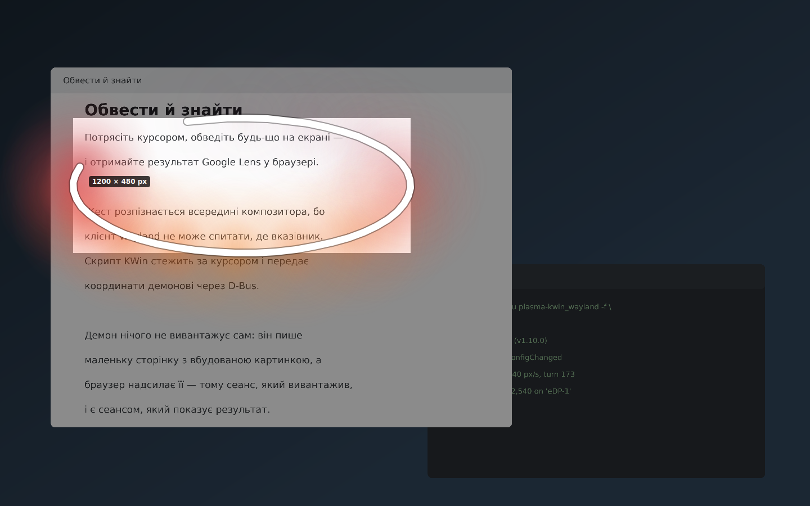

</div>

---

## Що воно робить

Потрясіть вказівником по діагоналі — вниз-праворуч, вгору-ліворуч, вниз-праворуч
— і екран застигне й потемніє. Обведіть те, що вас зацікавило. Воно відкриється
в Google Lens у вашому браузері.

Оце і вся ідея. Усе решта нижче — це те, що відбувається навколо неї.

* **Обведіть або потягніть рамку.** Від руки за замовчуванням, як на телефоні.
  *Shift* — прямокутник, а клац по вікну бере саме те вікно.
* **Нічого не надсилається, доки ви не скажете.** Виділення чекає з ручками, за
  які можна тягнути, і кнопками, які кажуть, що кожна робить. Вивантаження не
  можна забрати назад, тож є мить, щоб перевірити.
* **Замалюйте те, що не має піти** — токен, адресу, імʼя в кутку. Його зафарбують
  *перед* тим, як буде зроблено картинку, тож версії з ним просто не існує.
* **Скопіювати чи зберегти замість пошуку.** Те саме виділення, три інші місця,
  куди його відправити.
* **Або приколоти до екрана** й лишити там, поки працюєте, — коли те, що треба
  прочитати, за вікном, у яке треба друкувати.
* **Те саме місце, що й минулого разу**, до пікселя — коли стежите за числом,
  яке змінюється, а намальований від руки прямокутник щоразу трохи інший.
* **Взяти колір з екрана.** Екран уже застиг і вже збільшений під вашим
  вказівником; клац по пікселю — і його hex у буфері обміну.
* **Виділити текст на застиглому екрані** й шукати самі слова, а не їхню
  картинку, — або скопіювати їх так, щоб нічого не залишало машину.
  Необовʼязкове локальне розпізнавання, вимкнене, доки ви його не ввімкнете.
* **Українська та англійська**, за мовою системи.

---

## Знімки екрана

| | |
|---|---|
| 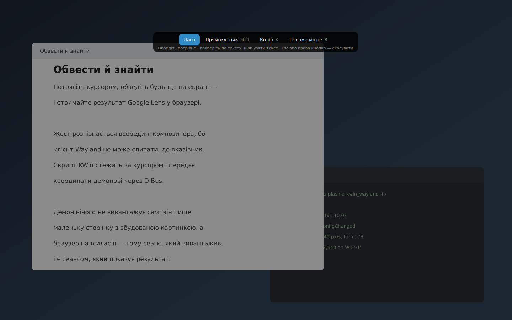 **Потрясли — екран застиг.** Ласо, прямокутник — або те саме місце, що й минулого разу. |  **Обведіть.** Широка біла лінія з кольоровим сяйвом, що йде за рукою. |
| 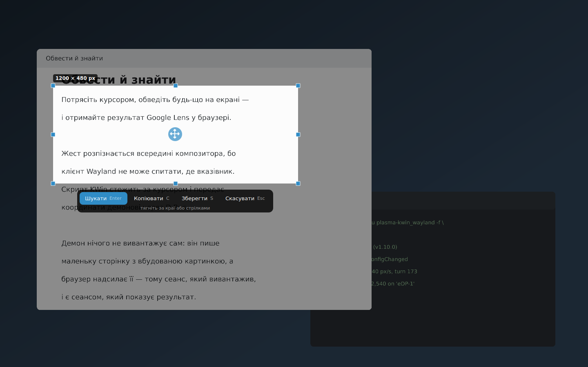 **Ще нічого не надіслано.** І воно каже, що саме надішле — у пікселях і кілобайтах. | 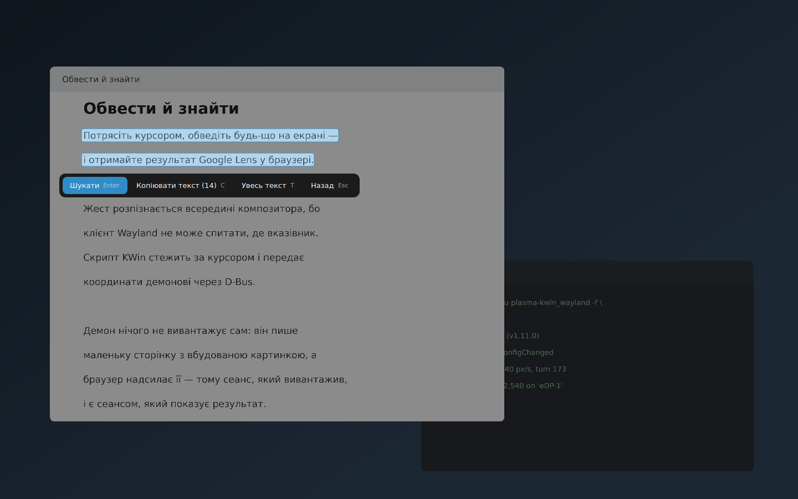 **Проведіть по тексту — і отримаєте текст**: шукатимуться слова, а не картинка. |
| 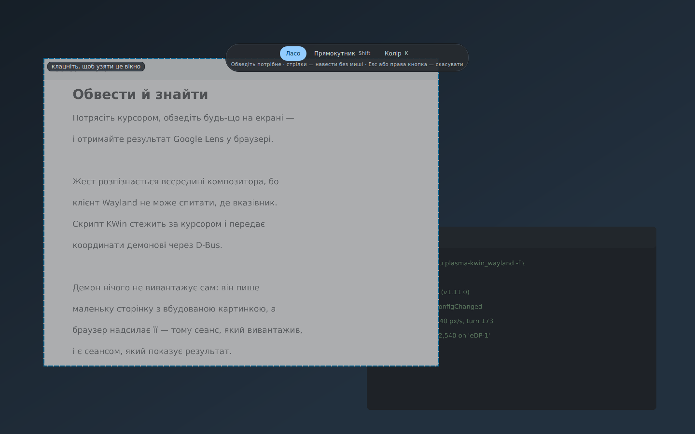 **Клацніть по вікну** замість того, щоб старанно його обводити. | 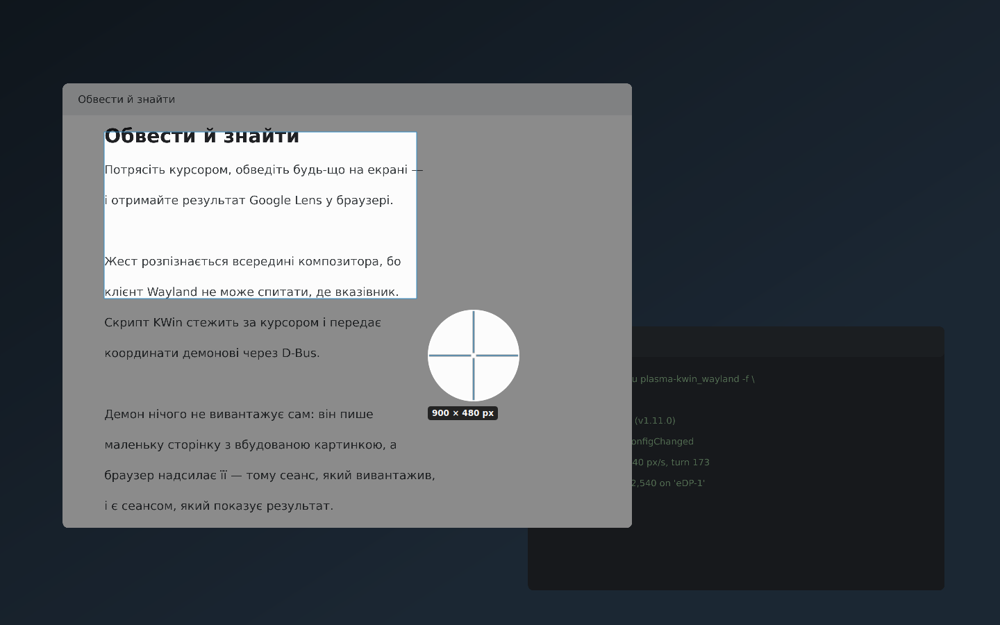 **Лупа, поки ви цілитеся**, щоб край ліг туди, куди ви хотіли. |

---

## Встановлення

Потрібні **KDE Plasma 6 на Wayland** і **Python 3.11 або новіший**.

```bash
git clone https://github.com/fand1l/cts_gl.git
cd cts_gl
./install.sh
```

Оце й усе. Інсталятор сам зрозуміє, який у вас дистрибутив — Fedora, Debian,
Ubuntu, Arch, openSUSE — і спитає, перш ніж щось ставити. Самій програмі root не
потрібен ніде; про пароль спитає лише ваш пакетний менеджер.

Він кладе в домашню теку чотири речі: демон, скрипт KWin, що стежить за
курсором, службу `systemd --user`, щоб воно стартувало разом із сеансом, і
запис у меню програм.

**Вийдіть із сеансу і зайдіть знову** після встановлення, щоб KWin завантажив
скрипт.

Далі оновлює одна команда — вона йде за гілкою `deploy`:

```bash
./install.sh update
```

Вона каже, що у вас стоїть і що зараз поставить: у кожного релізу, крім номера,
є назва — `1.2.0 “better-version-control”` одразу каже, який це. [Що змінилось у
кожному](CHANGELOG.md).

Старішу версію вона тихо не поставить. Повернутися назад можна — це і є вихід
із `--dev`-збірки, яка зламалася, — але для цього треба `--downgrade`, і разом
із нею стираються налаштування: новіша версія записала те, чого старіша не вміє
прочитати. Знімки лишаються, і перед стиранням вона спитає ще раз.

<details>
<summary>Інші команди</summary>

```bash
./install.sh update               # взяти гілку deploy і перевстановити
./install.sh update --dev         # …взяти натомість «dev»: найновіше, ще не переглянуте
./install.sh update --downgrade   # …навіть якщо вона старіша, разом із налаштуваннями
./install.sh reinstall            # перевстановити те, що лежить у цій теці
./install.sh reinstall --config   # …і стерти налаштування (спитає двічі)
./uninstall.sh                    # видалити, знімки лишити
./uninstall.sh --purge            # видалити разом зі знімками
```

Будь-яка з них приймає `--debug` — тоді замість галочки буде видно все, що
кожен крок робив.

Запамʼятати варто `update`. Він іде за гілкою **`deploy`** — тим кодом, про який
вирішено, що його можна запускати, — і сам переставить теку на неї, якщо вона
стоїть деінде. `reinstall` не має до git жодного стосунку: він ставить те, що
лежить у теці, хай там що.

`--dev` іде натомість за гілкою **`dev`** — туди робота потрапляє одразу, як її
написано. Її ще ніхто не дивився, і вона час від часу буде зламана, тому команда
щоразу про це попереджає. Звичайний `update` повертає вас на `deploy`.

Порядок такий, що гірше зробити не може: якщо fetch не вдався, нічого не
переставлено й не видалено, і працює та сама копія, що й працювала. Ваші
налаштування, знімки й калібрування лишаються в будь-якому разі.

</details>

---

## Як користуватися

### Жест

Трясіть вказівником **по діагоналі** — вниз-праворуч, вгору-ліворуч,
вниз-праворуч — різко, на одному місці. Приблизно 150 пікселів на мах, двічі,
десь за пів секунди.

Якщо не спрацьовує — або спрацьовує, коли ви просто працюєте, — не лізьте в
налаштування: **Налаштування → Відкалібрувати жест…** виміряє з десяток ваших
власних махів і виведе з них усі пороги. Над кнопкою крапка проходить рівно той
рух, якого просять ваші поточні налаштування, — видно, що вони означають.

Ще можна натиснути **Meta+Shift+L** або **Зняти зараз** у меню трея.

### Коли екран застиг

| | |
|---|---|
| **Потягніть** | намалюйте петлю або тримайте *Shift* для прямокутника |
| **Клацніть по вікну** | візьме саме те вікно |
| **Проведіть по тексту** | візьме текст, а не картинку |
| **Те саме місце**, або *R* | саме там, де ви виділяли минулого разу |
| **Колір**, або *K* | взяти колір з екрана замість виділення |
| **Esc** або права кнопка | забути |

Далі виділення чекає. Тягніть вісім ручок, щоб змінити розмір, ручку посередині
— щоб пересунути, стрілки — щоб посунути на піксель. А натиснувши деінде,
почнете спочатку.

Над ним два рядки: розмір того, що ви виділили, а під ним — що насправді піде:
`→ 1000 × 400, ~30 KB JPEG`. Це різні числа, і тепер видно, що саме роблять
*Найбільша сторона* і *Якість JPEG*.

| кнопка | клавіша | |
|---|---|---|
| **Шукати** | *Enter* | надіслати в Google Lens |
| **Копіювати** | *C* | у буфер обміну |
| **Зберегти** | *S* | PNG у теку «Зображення» |
| **Приколоти** | *P* | лишити на екрані, поверх усього |
| **Замалювати** | *B* | зафарбувати те, що не має піти |
| **Скасувати** | *Esc* | забути |

**Приколоти** — друге, про що варто знати. Воно лишає кроп на екрані маленьким
віконцем поверх усього: його можна тягати мишею, крутити колесом, щоб
масштабувати, і закрити на *Esc* або середньою кнопкою. *Ctrl+C* на ньому
копіює. Стає в пригоді щоразу, коли те, що треба прочитати, за вікном, у яке
треба друкувати.

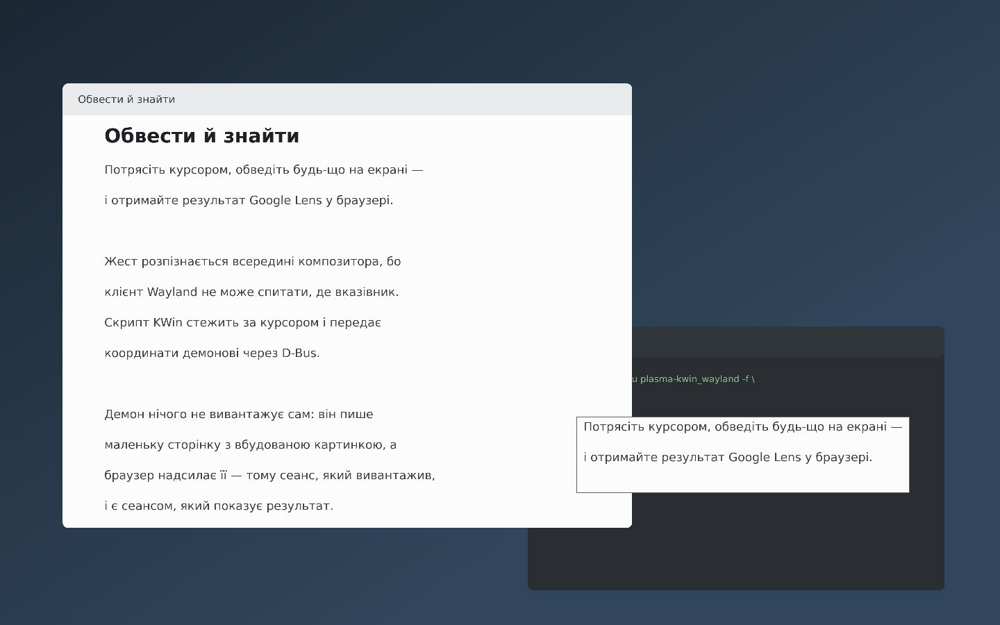

Про **Замалювати** теж варто знати. Увімкніть — і проведіть по токену, адресі,
імені в кутку: їх зафарбують *перед* тим, як буде зроблено картинку, тож
версії з ними просто не існує. *Backspace* скасовує останній прямокутник,
*Esc* виходить із режиму. Слова під ними зникають і з розпізнаного тексту.

### Піпетка

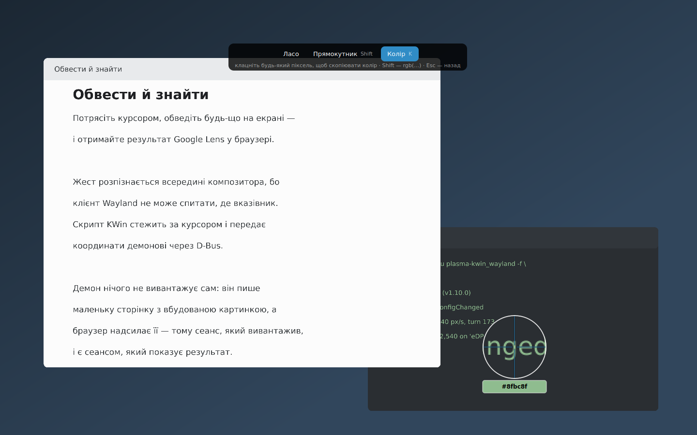

**Колір** (*K*) перетворює оверлей на піпетку. Затемнення зникає, лупа йде за
вказівником і показує під собою колір пікселя та його hex, а клац копіює
`#rrggbb` — або `rgb(…)`, якщо тримати *Shift*. *Esc* повертає до виділення.

У Plasma є власна піпетка, тож для стільниці це не новина. Вона тут, бо
відповідь і так була на екрані: доки ви думаєте, що це за колір, програма вже
застигла екран і вже збільшила його під вашим вказівником — і викидала це
значення.

### Текст на екрані

Увімкніть **Робити текст на екрані виділюваним** — і слова на застиглому екрані
стануть виділюваними, як текст у браузері. Проведіть по реченню або натисніть
*T*, щоб узяти все знайдене.

| кнопка | клавіша | |
|---|---|---|
| **Шукати** | *Enter* | шукати самі слова, а не їхню картинку |
| **Копіювати текст** | *C* | у буфер обміну |
| **Увесь текст** | *T* | узяти все, що на екрані |
| **Назад** | *Esc* | відпустити текст, знімок лишити |

Такий пошук не вивантажує нічого: слова вже прочитані, тож це звичайний
вебпошук. А якщо ви виділили посилання, кнопка каже **Відкрити посилання** й
відкриває його.

Читає `tesseract` на вашій машині. Нічого не вивантажується, ключі не потрібні,
і воно вимкнене, доки ви не попросите.

### Трей

Іконка тьмяніє, коли струшування не спрацює, а підказка каже, яка саме з кількох
можливих причин, — включно з тією, яку самотужки вгадати справді важко: коли KWin
досі виконує старішу копію скрипта, ніж лежить на диску.

У **Останніх знімках** лежать кілька найновіших, а **Усі знімки…** відкривають
вікно з рештою.

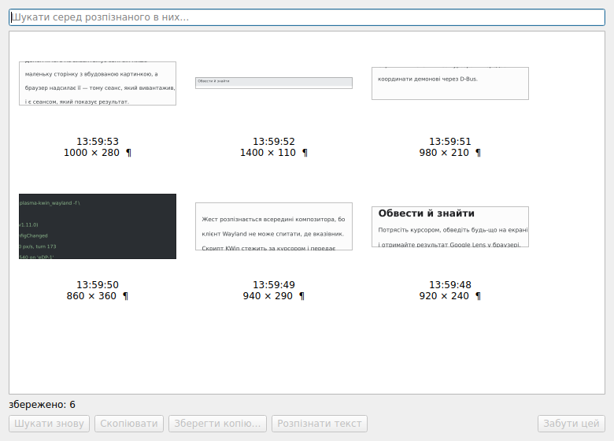

Поле вгорі шукає **по тексту, розпізнаному всередині них**, — тож «що це була за
помилка, яку я гуглив минулого тижня» стає питанням, на яке є відповідь. Звідси
кожен знімок можна знайти знову, скопіювати, зберегти або прочитати, а *Delete*
забуває його.

Скільки їх зберігати — тепер ваше рішення. Раніше було пʼять, бо меню трея з
тридцяти пунктів непридатне, — а це судження про меню, не про потрібну кількість.

---

## Налаштування

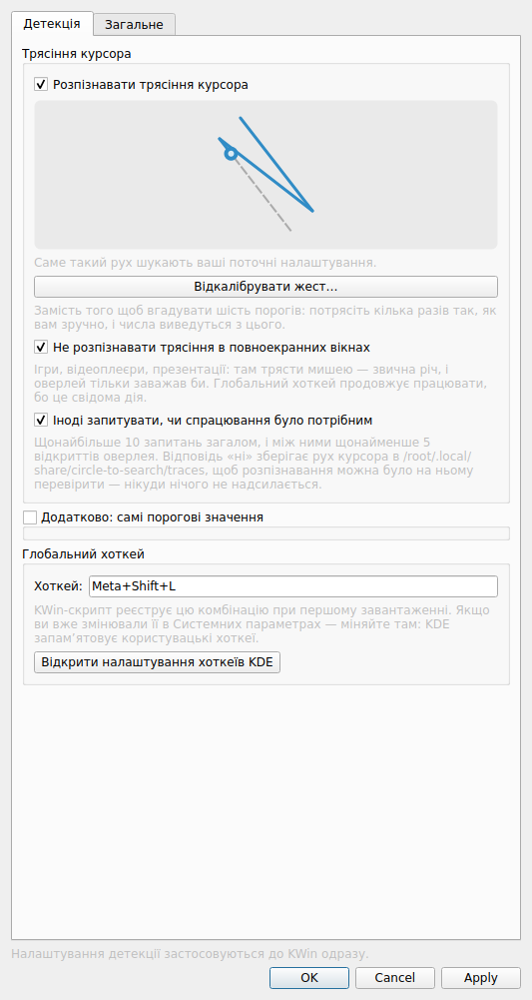

Більшість вам не знадобиться ніколи. Ті, що варто знати:

| | |
|---|---|
| **Відкалібрувати жест…** | виміряє ваше струшування й виставить із нього всі пороги |
| **Розпізнавати трясіння курсора** | вимкнено — лишаються хоткей і трей |
| **Форма виділення** | ласо чи прямокутник; *Shift* міняє на одне перетягування |
| **Перевіряти виділення перед надсиланням** | увімкнено — вимкнене надсилає одразу після відпускання |
| **Збільшувати під час виділення** | лупа біля вказівника |
| **Робити текст на екрані виділюваним** | необовʼязкове локальне розпізнавання |
| **Скільки зберігати** | знімки, які пропонують трей і вікно знімків |
| **Оверлей на кожному моніторі** | щоб виділення могло перетнути стик |

Десять порогових значень сховані за **Додатково**, бо калібрування майже завжди
кращий шлях.

---

## Якщо щось не працює

**Нічого не відбувається, коли трясу.** Наведіть на іконку в треї — вона скаже,
яка частина не та. Найчастіше відповідь — *вийти з сеансу і зайти знову*: KWin
завантажує скрипт один раз, при вході, і далі виконує саме ту копію.

**Відкривається, коли я просто працюю.** Відкалібруйте. Якщо не допомогло —
підніміть *Мінімальну швидкість маху* в **Додатково**: свідоме струшування — це
різкий рух, а малювання й перетягування повільні.

**Оверлей за панеллю.** Піднімає його скрипт KWin; якщо він не завантажений — не
підніме. Перевірте *Системні параметри → Керування вікнами → Скрипти KWin*.

**Сторінка Lens відкривається порожня.** Вивантажує ваш браузер, а не ця
програма, тож зазвичай винен блокувальник вмісту. Спробуйте у вікні без нього.

Довші відповіді й ще десятків зо два способів зламатися, з міркуваннями за
кожним, — у [технічній документації](docs/TECHNICAL.md#what-can-break-and-how-to-debug-it)
(англійською).

---

## Приватність, без викрутасів

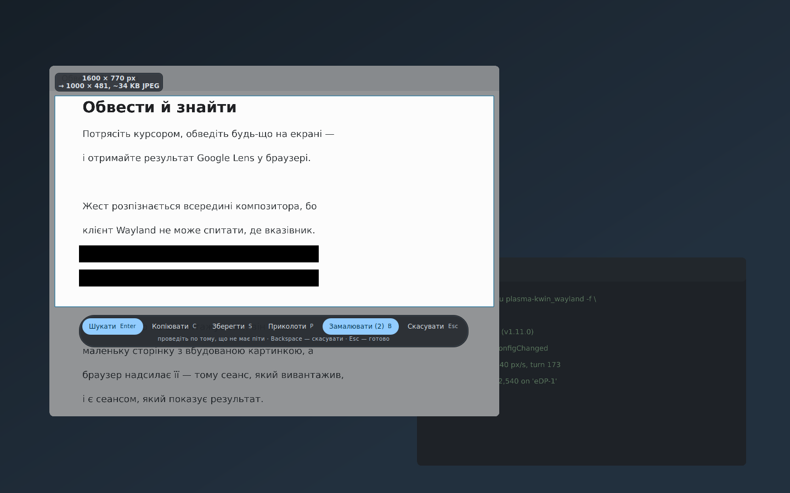

* **Можна спершу зафарбувати частину.** *Замалювати* заливає намальовані вами
  прямокутники суцільним — і це стається *перед* тим, як робиться картинка, а не
  поверх неї. Копії зображення з ними просто не існує: ні в буфері обміну, ні в
  збереженому PNG, ні в збереженому знімку, ні на сторінці, яку надсилає
  браузер. Слова під ними зникають і з розпізнаного тексту.
* Демон **не робить жодних мережевих зʼєднань сам**. Він пише маленьку локальну
  сторінку з вбудованим виділенням і віддає її вашому браузеру, а вже браузер
  розмовляє з Google. Тому сеанс, який вивантажує, — ваш сеанс; саме тому
  сторінка з результатом і відкривається там, де ви її можете прочитати.
* **Розпізнавання тексту локальне.** `tesseract`, на вашій машині, і лише якщо
  ви його ввімкнете.
* **Жодних ключів API, акаунтів чи телеметрії.** Нічого не збирається.
* Пʼять останніх знімків лежать у `~/.local/share/circle-to-search/recent`, щоб
  трей міг запропонувати їх ще раз. Вимикається в налаштуваннях, або
  `./uninstall.sh --purge`.

---

## Хто це написав

**Цю програму написав Claude** — модель ШІ від Anthropic — за кілька сеансів:
архітектуру, код, тести й цю документацію.

[@fand1l](https://github.com/fand1l) керував роботою: обирав, що робити,
перевіряв кожну версію на живому залізі й надсилав ті скріншоти й звіти про
помилки, які її виправляли. Кілька речей, заради яких програмою взагалі варто
користуватися, — виділюваний текст на застиглому екрані, обведення в стилі
Android, зловлене вікно, якого не було видно, — існують саме тому, що він
спробував і сказав, що не так.

Здалося чеснішим сказати про це, ніж дати вам припустити інше.

---

## Ліцензія

MIT — див. [LICENSE](LICENSE).

Не повʼязано з Google. «Circle to Search» і «Google Lens» — назви Google для
речей Google; це незалежна програма, яка відкриває їхню публічну вебточку у
вашому браузері.
